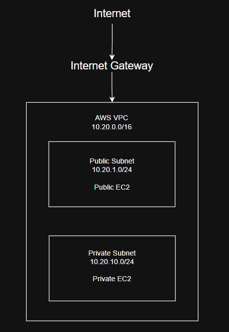

# AWS Secure Enterprise Network

## Overview

This project designs and implements a secure enterprise network environment using Amazon Web Services (AWS).

The project focuses on applying practical cloud networking and cybersecurity principles to a simulated organizational environment. The infrastructure is designed around network segmentation, controlled access, least privilege, monitoring, logging, and security remediation.

Rather than deploying isolated AWS services, this project demonstrates how networking and security components work together within an enterprise-style cloud environment.

## Project Objectives

- Design a structured AWS Virtual Private Cloud (VPC)
- Apply IP addressing and subnetting principles
- Separate public and private workloads through network segmentation
- Configure routing and controlled internet connectivity
- Implement restrictive Security Group rules
- Apply IAM and least-privilege access principles
- Deploy and administer Linux-based EC2 instances
- Implement logging and infrastructure monitoring
- Explore AWS threat-detection capabilities
- Identify and remediate controlled security misconfigurations
- Document security decisions and network traffic flows
- Automate infrastructure deployment using Infrastructure as Code in a later phase

## Architecture

The initial network uses the following address space:

| Network | CIDR | Purpose |
|---|---|---|
| AWS VPC | `10.20.0.0/16` | Main cloud network |
| Public Subnet | `10.20.1.0/24` | Internet-facing resources |
| Private Subnet | `10.20.10.0/24` | Internal resources |

### Initial Architecture

The architecture will evolve as additional networking, monitoring, and security controls are implemented.

## AWS Services

The project will progressively incorporate:

- Amazon VPC
- Amazon EC2
- AWS Identity and Access Management (IAM)
- Amazon S3
- Amazon CloudWatch
- AWS CloudTrail
- Amazon GuardDuty

## Networking Concepts

This project applies:

- TCP/IP
- CIDR addressing
- Subnetting
- Routing
- Public and private network segmentation
- Internet gateways
- Route tables
- Security Groups
- DNS
- Ingress and egress control

## Security Principles

### Least Privilege

Users, roles, services, and network resources should receive only the permissions and connectivity required to perform their intended functions.

### Network Segmentation

Public-facing and internal resources are separated into different network segments to reduce unnecessary exposure.

### Defense in Depth

Security controls are implemented across multiple layers:

- Identity
- Network
- Compute
- Data
- Logging
- Monitoring

### Visibility and Auditing

AWS logging and monitoring services will be used to provide visibility into infrastructure activity and security-relevant events.

## Security Scenarios

Controlled security scenarios will be performed only against resources created specifically for this lab.

Each scenario will follow:

Misconfiguration → Detection → Investigation → Risk Assessment → Remediation → Verification

Planned scenarios include:

- Overly permissive SSH access
- Excessive IAM permissions
- Improperly configured storage access
- Network access-control misconfigurations

Each scenario will document the security issue, potential impact, evidence, remediation process, and final verification.

## Project Roadmap

### Phase 1 — Network Design

- [ ] Define network requirements
- [ ] Create IP addressing plan
- [x] Design initial AWS architecture
- [ ] Document intended traffic flows

### Phase 2 — AWS Network Deployment

- [ ] Create custom VPC
- [ ] Create public subnet
- [ ] Create private subnet
- [ ] Configure Internet Gateway
- [ ] Configure route tables
- [ ] Configure Security Groups
- [ ] Deploy EC2 instances
- [ ] Validate network connectivity

### Phase 3 — Identity and Security

- [ ] Configure IAM roles and policies
- [ ] Apply least-privilege permissions
- [ ] Harden network access
- [ ] Review public exposure
- [ ] Secure storage resources

### Phase 4 — Logging and Detection

- [ ] Configure AWS CloudTrail
- [ ] Configure Amazon CloudWatch
- [ ] Enable security monitoring
- [ ] Configure Amazon GuardDuty
- [ ] Review security events and findings

### Phase 5 — Security Testing and Remediation

- [ ] Test controlled security misconfigurations
- [ ] Investigate findings
- [ ] Document security risks
- [ ] Apply remediation
- [ ] Verify corrected configurations

### Phase 6 — Infrastructure as Code

- [ ] Rebuild infrastructure using Terraform
- [ ] Store infrastructure configuration in version control
- [ ] Validate repeatable deployment
- [ ] Document Terraform architecture

## Repository Structure

aws-secure-enterprise-network/
├── README.md
├── architecture/
├── docs/
├── screenshots/
├── security-scenarios/
├── scripts/
└── terraform/

## Status

🚧 **In Development**

The project is being developed incrementally, beginning with network architecture and progressing toward security monitoring, controlled security testing, remediation, and infrastructure automation.

## Disclaimer

All security testing documented in this repository is performed in an isolated AWS environment owned and controlled by the project author. The security scenarios are intended solely for educational and defensive cybersecurity purposes.