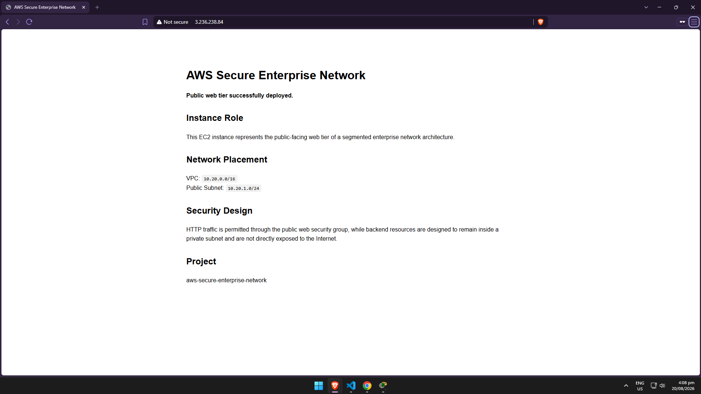
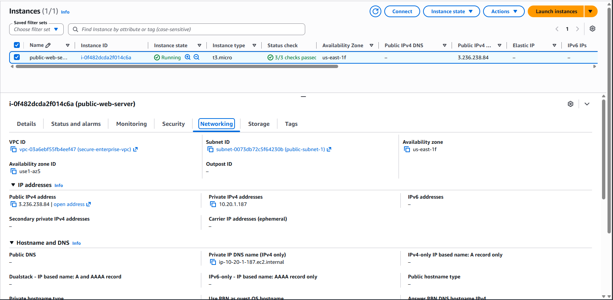
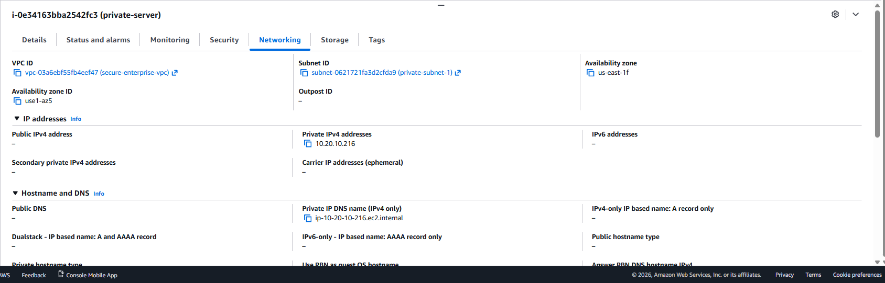

# EC2 Deployment and Tier Connectivity

## Overview

This section documents the deployment of the EC2 compute layer for the AWS Secure Enterprise Network project.

The architecture separates the public-facing web server from the private application server using dedicated public and private subnets.

## EC2 Architecture

| Instance | Network Tier | Subnet | Public IP | Purpose |
|---|---|---|---|---|
| public-web-server | Public | public-subnet-1 | Yes | Internet-facing web server |
| private-app-server | Private | private-subnet-1 | No | Internal application server |

The public web server acts as the externally accessible tier, while the private application server is isolated from direct Internet access.

---

## Public Web Server

The `public-web-server` EC2 instance was deployed inside:

- VPC: `secure-enterprise-vpc`
- Public subnet: `10.20.1.0/24`
- Security group: `public-web-sg`
- Operating system: Amazon Linux 2023

The instance receives a public IPv4 address because it is designed to accept web traffic from the Internet.



### Network Configuration

The instance also receives a private IPv4 address from the public subnet.



---

## Private Application Server

The `private-app-server` EC2 instance was deployed inside:

- VPC: `secure-enterprise-vpc`
- Private subnet: `10.20.10.0/24`
- Security group: `private-server-sg`
- Operating system: Amazon Linux 2023
- Application port: TCP `8080`

The instance does **not** have a public IPv4 address. This prevents direct inbound access from the Internet.



---

## Security Group Segmentation

The architecture uses security-group references rather than exposing the private application server to arbitrary IP addresses.

The public tier accepts required Internet-facing traffic.

The private tier permits application traffic on TCP port `8080` from the `public-web-sg` security group.

This creates the following communication path:

```text
Internet
   |
   | HTTP :80
   v
public-web-server
   |
   | TCP :8080
   v
private-app-server
```

The private application server therefore remains isolated from direct Internet access while still accepting application traffic from the authorized public tier.

---

## Connectivity Validation

Connectivity between the two tiers was validated from the public EC2 instance.

The public server sent an HTTP request to the private application's private IPv4 address on TCP port `8080`:

```bash
curl http://10.20.10.39:8080
```

The private application returned a successful response:

```text
Private Application Server
Connection successful.
This application is running in the private subnet.
Port: 8080
```

This verifies that:

1. The public and private instances can communicate through the VPC.
2. The private application is reachable on TCP port `8080`.
3. Security group rules permit the intended public-to-private communication.
4. The private application server does not require a public IPv4 address for internal communication.


---

## Security Design

The deployment follows a basic multi-tier security model:

- Internet-facing resources are placed in the public subnet.
- Internal application resources are placed in the private subnet.
- The private application server has no public IPv4 address.
- Security groups restrict communication between application tiers.
- Administrative SSH access to the public server is restricted rather than exposed universally.
- Application communication between tiers uses TCP port `8080`.

This design reduces the externally exposed attack surface and demonstrates network segmentation within an AWS VPC.

---

## Result

The EC2 deployment successfully demonstrates communication between a public web tier and an isolated private application tier.

The final validated path is:

```text
Internet
    |
    v
Public Subnet
public-web-server
    |
    | TCP 8080
    v
Private Subnet
private-app-server
```

The private application server remains inaccessible directly from the Internet while remaining reachable by the authorized public web tier.