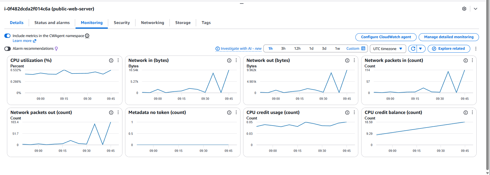
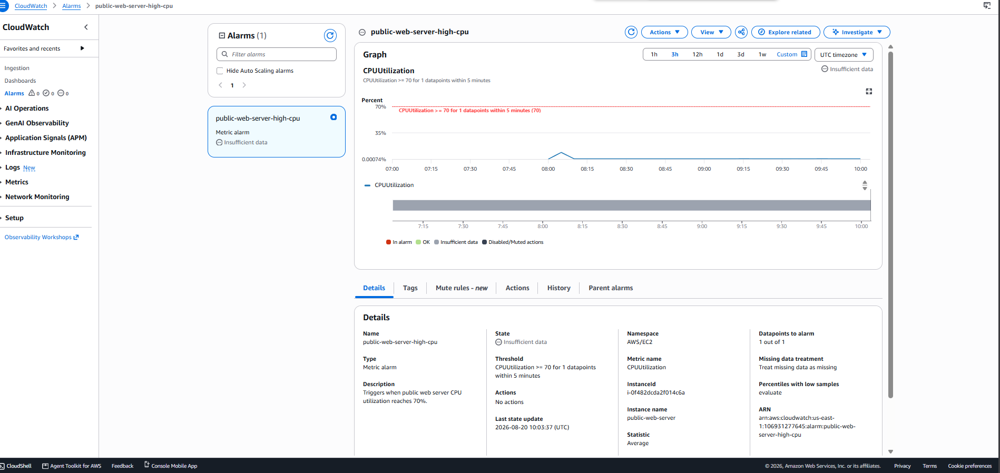

# Monitoring and Alerting

## Overview

Amazon CloudWatch is used to monitor the EC2 infrastructure deployed in the secure enterprise network.

## EC2 Monitoring

The public web server is monitored using standard Amazon EC2 CloudWatch metrics, including:

- CPU utilization
- Network traffic
- Network packets
- CPU credit usage
- CPU credit balance

## High CPU Alarm

A CloudWatch alarm was configured for the public web server to detect elevated CPU utilization.

### Configuration

- **Alarm:** `public-web-server-high-cpu`
- **Metric:** `CPUUtilization`
- **Statistic:** Average
- **Threshold:** Greater than or equal to 70%
- **Evaluation period:** 5 minutes
- **Datapoints to alarm:** 1 out of 1
- **Instance:** `public-web-server`

This alarm demonstrates basic infrastructure monitoring and provides a foundation for integrating automated notifications or remediation in a production environment.

